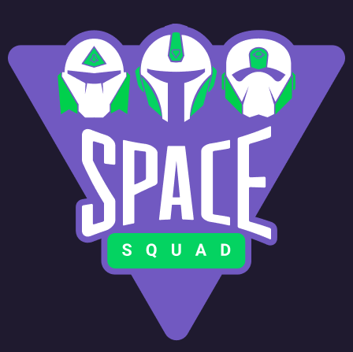
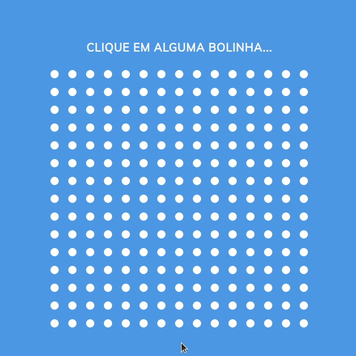

<p align="center">
  
</p>

<p align="center">
  
</P>
<p align="center">
  
  
  
  
</p>

---

<br>

<p align="center">
  
</p>

<br>

<p align="center">
  
</p>

<br>


### Projeto baseado no [site 65 - Ondas](https://www.dorlyneto.com/90sites/65-ondas) do desafio de fazer 90 sites em 90 dias desenvolvido por [Dorly Neto](https://github.com/dorlyneto).

# :pushpin: Tabela de conteúdos

* [Oque é](#computer-oque-é)
* [Tecnologias](#computer-tecnologias)
* [Features](#rocket-features)
* [Como rodar](#construction_como-rodar)
* [Autores](#wave_autores)

<br>

## :computer: Oque é

Este foi um projeto desenvolvido em equipe que faz parte do programa Space Squad, o programa de formação de mentores desenvolvido pela [Rocketseat](https://rocketseat.com.br/).

<br>

A proposta do desafio era escolher um projeto simples e criar uma melhoria e/ou refatoração.

<br>

## :computer: Tecnologias
This project was made using the follow technologies:
<ul>
  <li><a href="https://developer.mozilla.org/pt-BR/docs/Web/HTML">HTML</a></li>
  <li><a href="https://developer.mozilla.org/pt-BR/docs/Web/CSS">CSS</a></li>
  <li><a href="https://developer.mozilla.org/pt-BR/docs/Web/JavaScript">Javascript</a></li>
</ul>

## :rocket: Features

O grupo implementou 3 features que estão em branch's separadas. A escolha da feature utilizada se deu por decidirmos manter a essência do projeto e só acrescentar funcionalidades, o som e estilo nas bolinhas quando clicadas.

<br>

# :construction_worker: Como rodar
```bash
# Clone Repository
$ git clone https://github.com/nlnadialigia/90sites90days.git
```

### 💻 Iniciar projeto

```bash
# Siga para a pasta do projeto e procure a pasta: 65-Ondas

# Abra o arquivo HTML
```

- [Acesse o site - Ondas](https://ondas-space-squad.netlify.app)

<br>


## :wave: Autores

Nome | GitHub | Likedin | E-mail
---- | ------ | ------- | ------
Caio Campos | [Caio Campos](https://github.com/CampossCaio) | [Linkedin](https://www.linkedin.com/in/caio-campos-905955175/) | email
Hedenica Morais | [Hedenica Morais](https://github.com/hedenica) | [Linkedin](https://www.linkedin.com/in/hedenica/) | hedenica@hotmail.com
Hudson Duarte | [Hudson Duarte](https://github.com/huduarte) | [Linkedin](https://www.linkedin.com/in/huduarte/) | hudsoneeto@outlook.com
Nadia Ligia | [Nadia Ligia](https://github.com/nlnadialigia) | [Linkedin](https://www.linkedin.com/in/nlnadialigia/) | email
